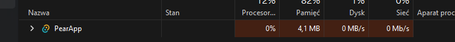
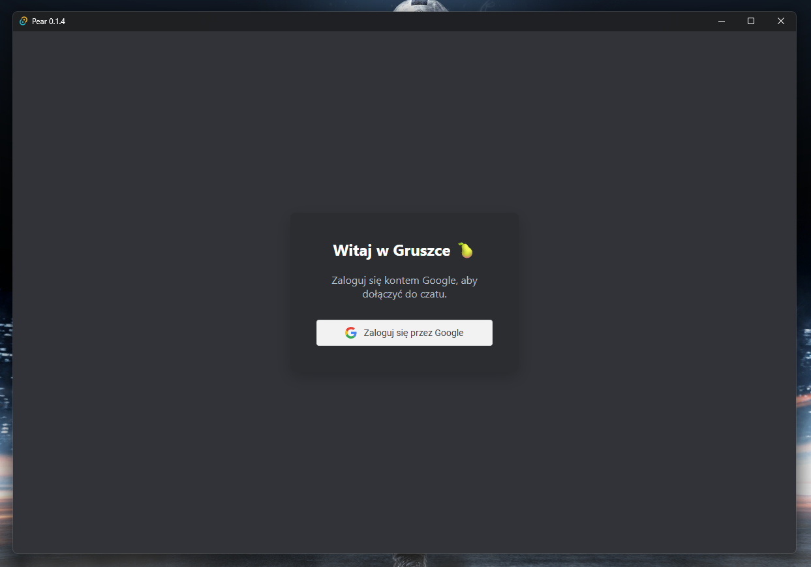
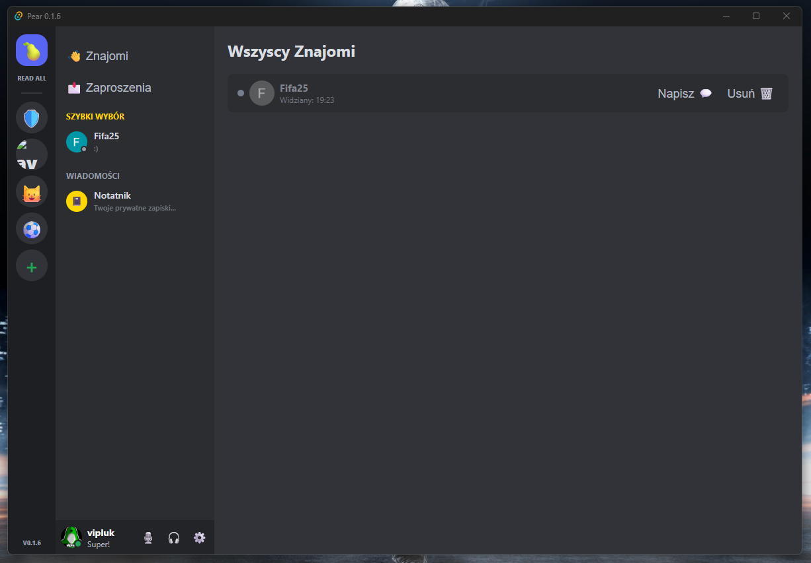
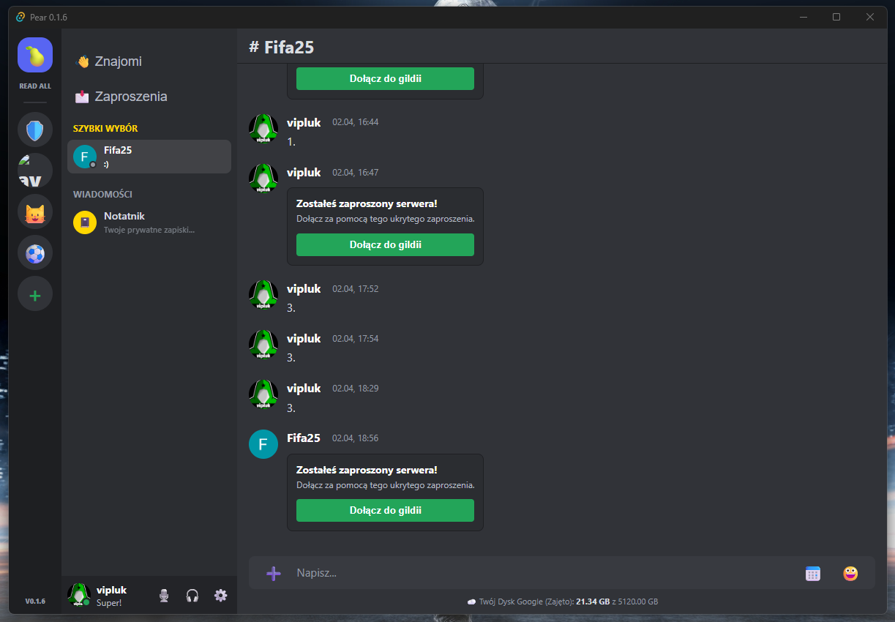
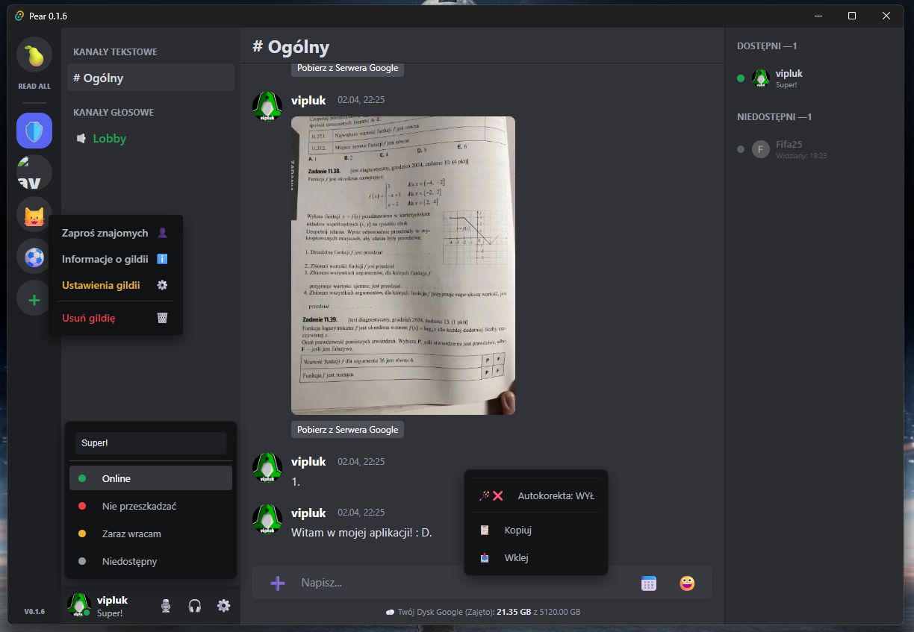
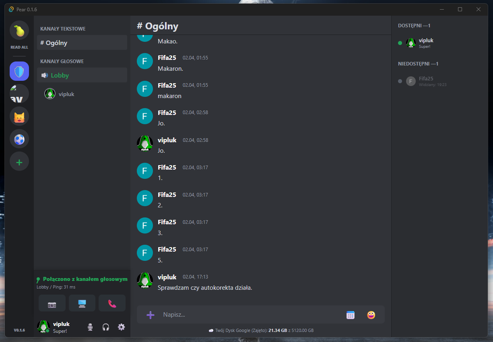
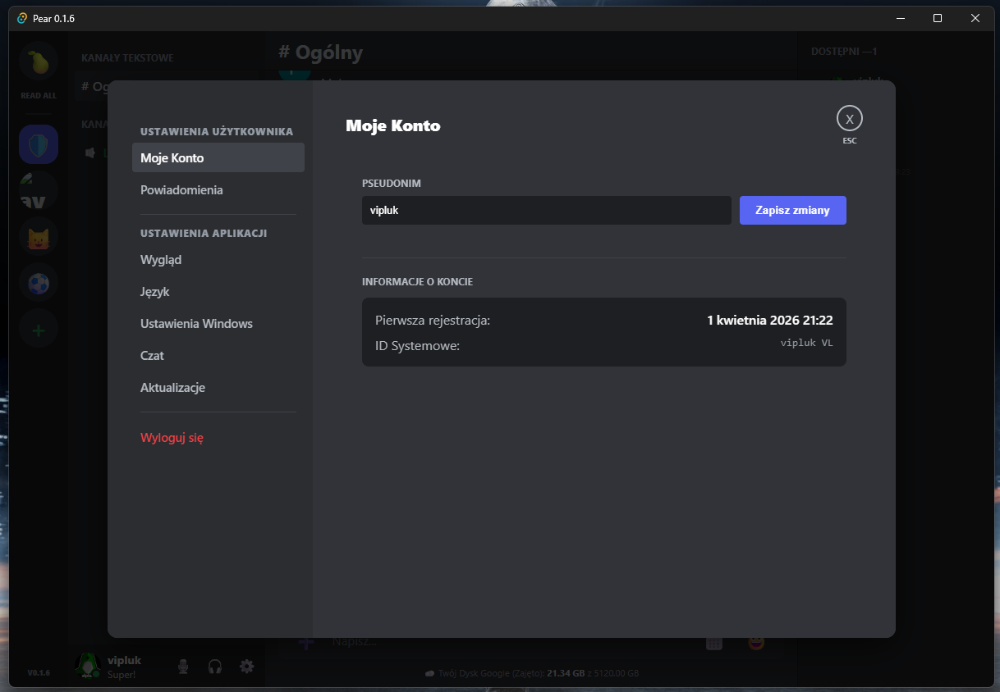

I’m slowly building a simple alternative to Discord, whose main features will be low CPU and RAM usage, no file size limits*, and Google Authentication login. I’m not currently offering public access.

*File size is limited by the user’s Google storage space

